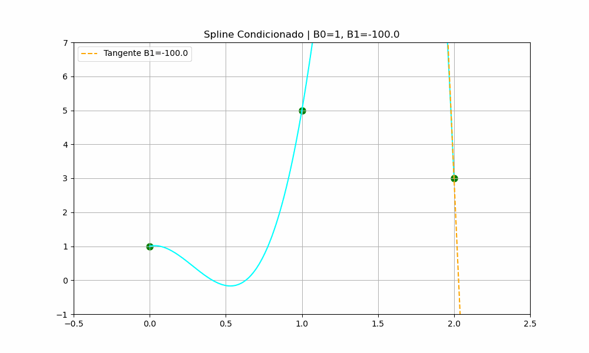
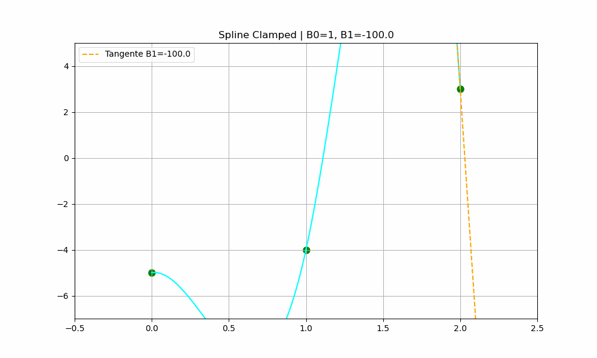
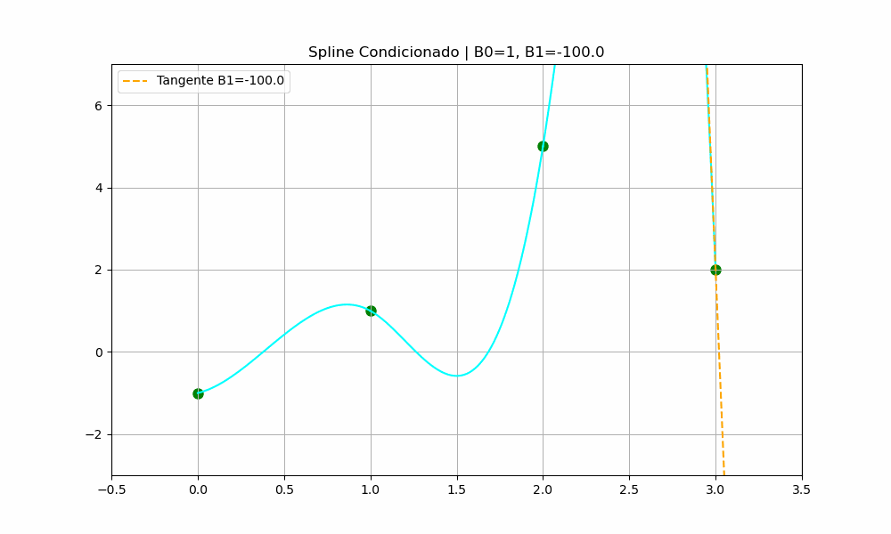

# Taller 4

- Joshua Daniel Menendez Farias
- Maria Celeste Gallardo Moreno
- Jesua Villacis

## Animacion splines cubicos

Para $(0,1),(1,5),(2,3)$

Para $(0,−5),(1,−4),(2,3)$

Para $(0,−1),(1,1),(2,5),(3,2)$

